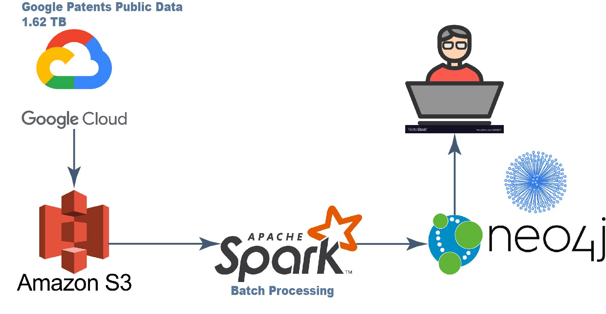

# Patent Vista

A bird's-eye view of patent landscape.

Click [here](https://docs.google.com/presentation/d/1GYmk3EMiETBooWJDNu6uFWAWcya_pcZEPCu1biHSnyw/edit#slide=id.gc6f73a04f_0_0) to see my presentation.

Click [here](https://www.youtube.com/watch?v=mJf5L2jHnGw) to see a video demo.

#### How to install and get it up and running

1. Migrate [data](https://cloud.google.com/public-datasets) from Google Cloud to AWS S3

2. Set up a Spark cluster on AWS (e.g., 4 EC2 instances including 1 master and 3 workers)

3. Install Neo4j on a separate instance

4. Change file index in run.sh, start index and end index

5. ```
   sh run.sh
   ```

### Introduction

---

Patent Vista is a data pipeline designed to visualizaing patent citation relationships to:

1. Spot VIP (very import patent) of a patent portfolio
   - More citations = more important (similar to more retweets more influence)
2. Check how a patent portfoli is structured (technical fields distribution)
   - What is the strategy of protecting the core technologies?
3. Identify potential licensees for monetizing patent asset
   - How to monetize patent asset?

### Architecture

---



1. 1.5 TB data is [migrated](https://github.com/shao-shuai/birdview-patent-landscape/blob/master/ingestion/README.md) from Google Cloud to Amazon S3
2. The data is splitted into 1667 batches, each batch is 1 GB
3. The batch data is fetched into Apache Spark for batch processing to extract citation information and patent ownership information
4. The result of the batch processing is sotred into Neo4j to visualizaing relatinships

### Dataset

---

Raw dataset is patents public data from Google Cloud.

### Engineering challenges

---

Writing data from Spark to Neo4j was quite slow at the beginning. I used [neo4j-python-driver](https://github.com/neo4j/neo4j-python-driver) for writing and it took more than 20 minutes for writing a batch.


Meanwhile neither [Neo4j JDBC driver](https://github.com/neo4j-contrib/neo4j-jdbc) nor [neo4j-spark-connector](https://github.com/neo4j-contrib/neo4j-spark-connector) supports writing Neo4j, also there is not enough documentation in writing Neo4j for both.


[neo4j-admin import](https://neo4j.com/docs/operations-manual/current/tutorial/import-tool/) is a very handy built-in command provided by Neo4j, writing a batch only took 6 seconds. But the problem is this command can only be used to import data into an empty database, if there is existing data in database, we cannot use this command. As I have `1667` batches,  merging all the processing results for the batches to use this command seems not that efficient.


Then I learned how to do batch writing with Cypher

```cypher
WITH $names AS nested
UNWIND nested AS x
MERGE (w:PATENT {name: x[0]})
MERGE (n:PATENT {name: x[1]})
MERGE (w)-[r:CITE]-(n)
```

This is very fast for writing nodes in Neo4j, but writing relationships could also take 50+ minutes.


Finally I found my **Swiss Army Knife**, creating a constraint which will automatically create a schema index in the database. With this, each batch takes less than 1 minute.💪

```cypher
CREATE CONSTRAINT ON (p:PATENT) ASSERT p.name IS UNIQUE
```


### Trade-offs

---

