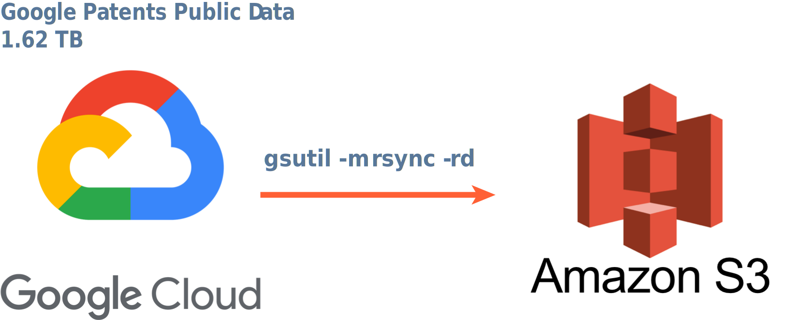

# Date Ingestion

1.62 TB Google Patents Public Data is migrated from Google Cloud to Amazon S3, with the command 

`gsutil -m rsync -rd gs://your-gcs-bucket s3://your-s3-bucket`, [Exporting data from Google Cloud Storage to Amazon S3](https://stackoverflow.com/questions/39329580/exporting-data-from-google-cloud-storage-to-amazon-s3)

